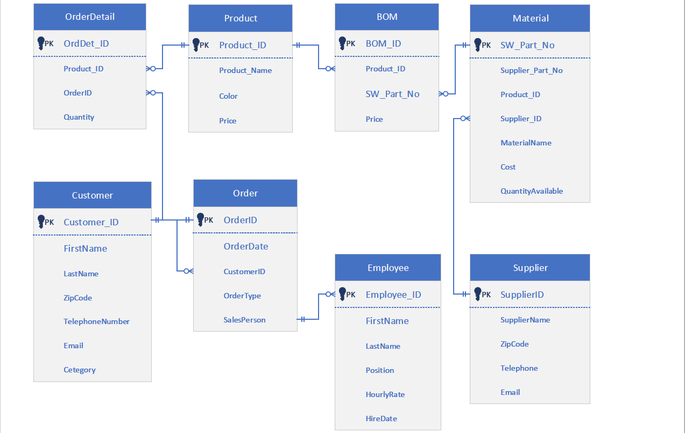

# smartHandTruck

Install the following dependencies

pip install flask_sqlalchemy
pip install wtforms
pip install flask_migrate
pip install flask_wtf

After installing the required dependencies, run the command `flask run` from the project root folder

Following is the ERD used for the project. 
Courtesy MSIS, Kelley School of Business

